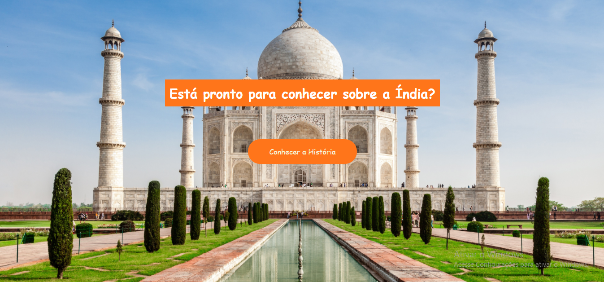
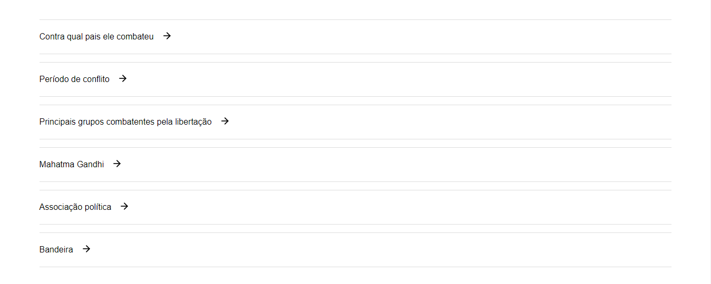
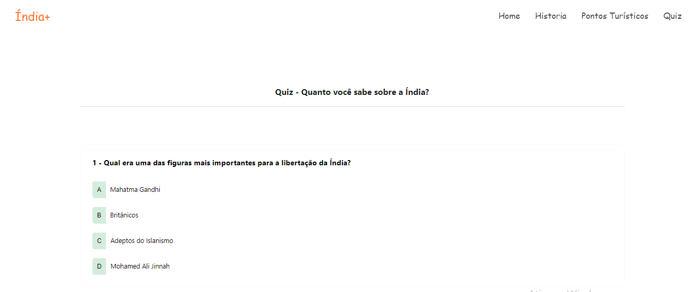
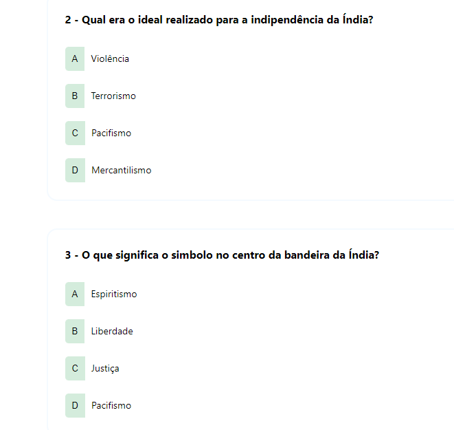
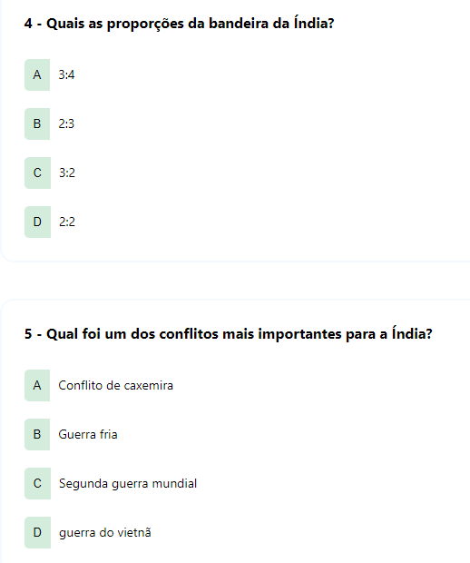
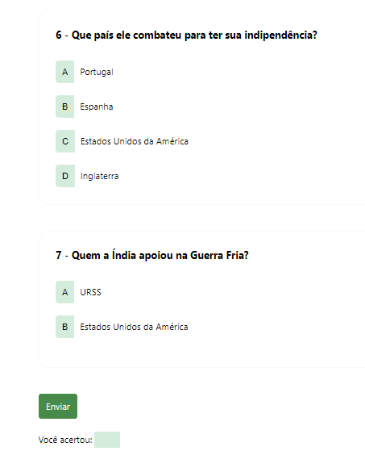

<h2>Atividade de História - Tudo sobre a Índia</h2>

:astronaut: :woman_astronaut: :man_singer:

Essa atividade foi realizada, como parte das avaliações do 3° bimestre da disciplina de história. Em que foi composto por 6 integrantes, sendo eles:

<ul>
  <li><strong>CAROLINA BESERRA DO NASCIMENTO</strong></li>
  <li><strong>GUILHERME LEME ATENCIO DE OLIVEIRA</strong></li>
  <li><strong>JULIANO BITTENCOURT LEDO</strong></li>
  <li><strong>LÍVIA OLIVEIRA SANTOS</strong></li>
  <li><strong>MARCO ANTÔNIO ALVES PEREIRA</strong></li>
  <li><strong>RENAN PEREIRA DA SILVA</strong></li>
</ul>

<h3>Print das telas</h3>

Nessa sessão, veremos como ficou as telas do site India+.

<h4>Menu</h4>
  

<h4>Banner</h4>
  

<h4>História</h4>
  

  

<h4>Pontos Turísticos</h4>
  

<h4>Quiz</h4>
  

  

  

  

